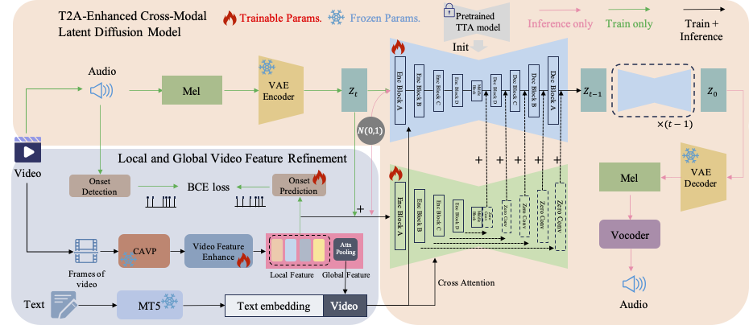

# STA-V2A: Video-to-Audio Generation with Semantic and Temporal Alignment (ICASSP 2025)

<p align="center">
        🤗 <a href="https://huggingface.co/y-ren16/STAV2A">Hugging Face</a>&nbsp&nbsp | &nbsp&nbsp🖥️ <a href="https://y-ren16.github.io/STAV2A">Demo</a> | &nbsp&nbsp📑 <a href="https://arxiv.org/pdf/2409.08601">Paper</a>&nbsp&nbsp
<br>

## 1. Introduction

Visual and auditory perception are two crucial ways humans experience the world. Text-to-video generation has made remarkable progress over the past year, but the absence of harmonious audio in generated video limits its broader applications. In this paper, we propose Semantic and Temporal Aligned Video-to-Audio (STA-V2A), an approach that enhances audio generation from videos by extracting both local temporal and global semantic video features and combining these refined video features with text as cross-modal guidance. To address the issue of information redundancy in videos, we propose an onset prediction pretext task for local temporal feature extraction and an attentive pooling module for global semantic feature extraction. To supplement the insufficient semantic information in videos, we propose a Latent Diffusion Model with Text-to-Audio priors initialization and cross-modal guidance. We also introduce Audio-Audio Align, a new metric to assess audio-temporal alignment. Subjective and objective metrics demonstrate that our method surpasses existing Video-to-Audio models in generating audio with better quality, semantic consistency, and temporal alignment. The ablation experiment validated the effectiveness of each module.

- **Local and Global Video Feature Refinement**: This paper proposes an onset prediction pretext task to obtain local temporal features of video alongside a trainable attentive pooling module to acquire global semantic features of video, achieving refinement and detailing of temporal and semantic information in videos.
- **T2A-Enhanced Cross-Modal Latent Diffusion Model**: This paper introduces a Latent Diffusion Model (LDM) framework where the initialization with T2A ensures high-quality audio
generation and the cross-modal guidance between text and video ensures semantic and temporal consistency in generated videos.
- **New Evaluation Metric for Audio Temporal Alignment**: This paper introduces a new metric, Audio-Audio Alignment (AAAlign), addressing the lack of effective metrics for the temporal alignment of audio.

<div align="center">
  
</div>

## 2. Code Usage

### 2.1 Environment

```
pip install -r requirement.txt
cd diffusers-0.20.0
pip install -e .
cd ..
```

### 2.2 Inference
Download checkpoints from 🤗 <a href="https://huggingface.co/y-ren16/STAV2A">Hugging Face</a>.
```
bash Inf_sh/inf.sh
```

### 2.3 Eval
```
# For FD, FAD, IS, and KL
bash EvalTools/Eval_audio.sh
# For AV-Align, AA-Align, PAM, and CLAP
bash EvalTools/Eval_all.sh
```

## 3. Citation
If our code and paper help you, please kindly cite:
```
@inproceedings{ren2025sta,
  title={Sta-v2a: Video-to-audio generation with semantic and temporal alignment},
  author={Ren, Yong and Li, Chenxing and Xu, Manjie and Liang, Wei and Gu, Yu and Chen, Rilin and Yu, Dong},
  booktitle={ICASSP 2025-2025 IEEE International Conference on Acoustics, Speech and Signal Processing (ICASSP)},
  pages={1--5},
  year={2025},
  organization={IEEE}
}
```

## License Agreement

**License**: The repository is licensed under the [Apache 2.0](LICENSE) License. 